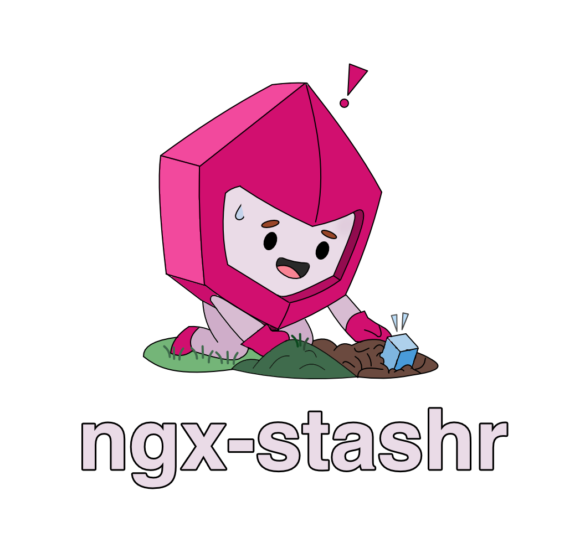

<div style="width: 100%;" align="center">
  <a href="https://github.com/nulzo/ngx-cachr">
    
  </a>
</div>

<br/>

<p align="center">
  <strong>A slim, signal-based library for shashing state in Angular.</strong>
</p>

<br/>

<p align="center">
  <a href="https://www.npmjs.com/package/ngx-stashr">
    
  </a>
  <a href="https://www.npmjs.com/package/ngx-stashr">
    
  </a>
  <a href="https://github.com/nulzo/ngx-stashr/blob/main/LICENSE">
    
  </a>
</p>


## Installation

```bash
npm i ngx-stashr
```

## Usage

### Create a stash

Define your state and actions in a state file (e.g., `counter.state.ts`).

```typescript
import { createStash } from 'ngx-stashr';

interface CounterState {
  count: number;
  increment: () => void;
  decrement: () => void;
  reset: () => void;
}

export const counterStash = createStash<CounterState>((set) => ({
  count: 0,
  increment: () => set((state) => ({ count: state.count + 1 })),
  decrement: () => set((state) => ({ count: state.count - 1 })),
  reset: () => set({ count: 0 }),
}));
```

### Use in your components

Use the stash directly in your components. It's just a signal really.

```typescript
import { Component } from '@angular/core';
import { counterStash } from './counter.state';

@Component({
  selector: 'app-counter',
  standalone: true,
  template: `
    <h1>Count: {{ stash().count }}</h1>
    <button (click)="stash().increment()">+</button>
    <button (click)="stash().decrement()">-</button>
    <button (click)="stash().reset()">Reset</button>
  `
})
export class CounterComponent {
  readonly stash = counterStash;
}
```

### Selectors (ie computed state)

You can create computed signals for specific slices of state. This can further optimize performance if needed.

```typescript
@Component({ ... })
export class CounterDisplayComponent {
  readonly stash = counterStash;
  
  // only updates when count changes
  readonly count = this.stash.select(state => state.count);
  
  // derived state
  readonly doubleCount = this.stash.select(state => state.count * 2);
}
```

## Middleware

### Persust

You can persist state to `localStorage` (or any other storage) using the `persist` middleware.

```typescript
import { createStash, persist } from 'ngx-stashr';

export const settingsStash = createStash(
  persist(
    (set) => ({
      theme: 'light',
      toggleTheme: () => set((state) => ({ 
        theme: state.theme === 'light' ? 'dark' : 'light' 
      })),
    }),
    {
      name: 'app-settings', // unique name
      // storage: sessionStorage // optional, just defaults as localStorage
    }
  )
);
```

### Logging and debugging

You can debug the state mutations with the `logger` middleware. It will report the previous state, action, and next state to the console.

```typescript
import { createStash, logger } from 'ngx-stashr';

export const stash = createStash(
  logger(
    (set) => ({
      count: 0,
      increment: () => set((state) => ({ count: state.count + 1 }), false, 'increment')
    }),
    { 
      name: 'CounterStash',
      enabled: true // defaults to true
    }
  )
);
```

### Chaining middlwares

You can compose middleware by swallowing. Just make sure `persist` sits as the outer wrapper if chaining it.

```typescript
export const stash = createStash(
  persist(
    logger(
      (set) => ({ count: 0 }),
      { name: 'MyStash' }
    ),
    { name: 'storage-key' }
  )
);
```

## Core API

### `createStash<T>(setup: StateCreator<T>)`

Creates a stash. Returns a Signal that also contains API methods.

### Stash Methods

- `stash()`: Get the current state (signal).
- `stash.get()`: Get the current state (non-reactive readonly snapshot).
- `stash.set(partial, replace?, ...args)`: Update state. `partial` can be an object or a function `(state) => partial`. Optional `args` are passed to listeners (just useful for logging actions).
- `stash.select(selector)`: Create a computed signal from the state.
- `stash.subscribe(listener)`: Subscribe to state changes manually.
